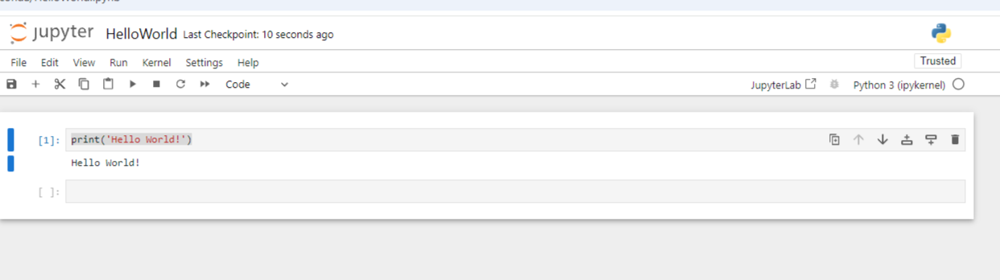
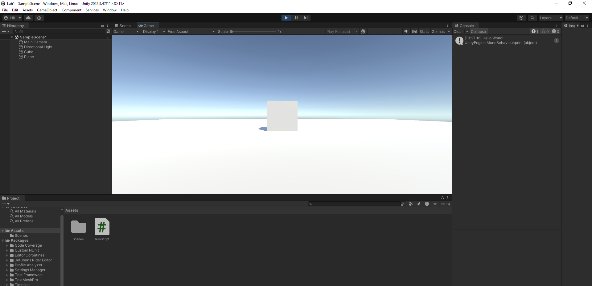

# АНАЛИЗ ДАННЫХ И ИСКУССТВЕННЫЙ ИНТЕЛЛЕКТ [in GameDev]
Отчет по лабораторной работе #1 выполнил(а):
- Шашурин Алексей Иванович
- РИ230914
Отметка о выполнении заданий (заполняется студентом):

| Задание | Выполнение | Баллы |
| ------ | ------ | ------ |
| Задание 1 | * | 60 |
| Задание 2 | * | 20 |
| Задание 3 | * | 20 |

знак "*" - задание выполнено; знак "#" - задание не выполнено;

Работу проверили:
- к.т.н., доцент Денисов Д.В.
- к.э.н., доцент Панов М.А.
- ст. преп., Фадеев В.О.

## Цель работы
Установить Anaconda и Unity, написать первую в них программу.

## Задание 1
### Написать программу Hello World на Python с запуском в Jupiter Notebook.

- Ознакомился с интерфейсом и функциональностью Anaconda и Jupiter Notebook.
  

## Задание 2
### Написать программу Hello World на C# с запуском на Unity. 

- Скачал Unity Hub с официального сайта, создал первый проект с программой Hello World на C#.
  

## Задание 3
### Оформить отчет в виде документации на github (markdown-разметка).

- Написал отчет лаболаторной работы по шаблону markdown-разметкой, загрузил на github

## Выводы

- Установил нужное ПО для последующей работы, получил первый опыт работы в Unity.

## Powered by

**BigDigital Team: Denisov | Fadeev | Panov**
